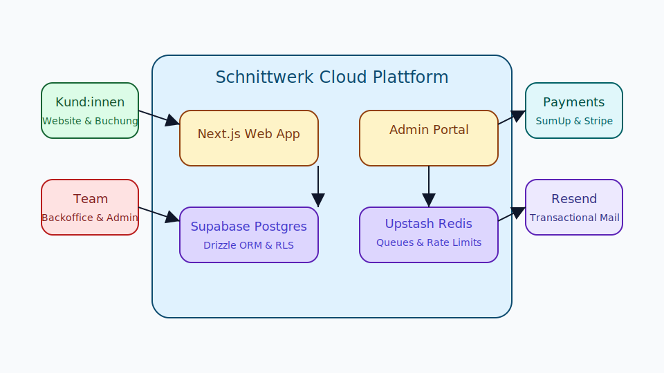
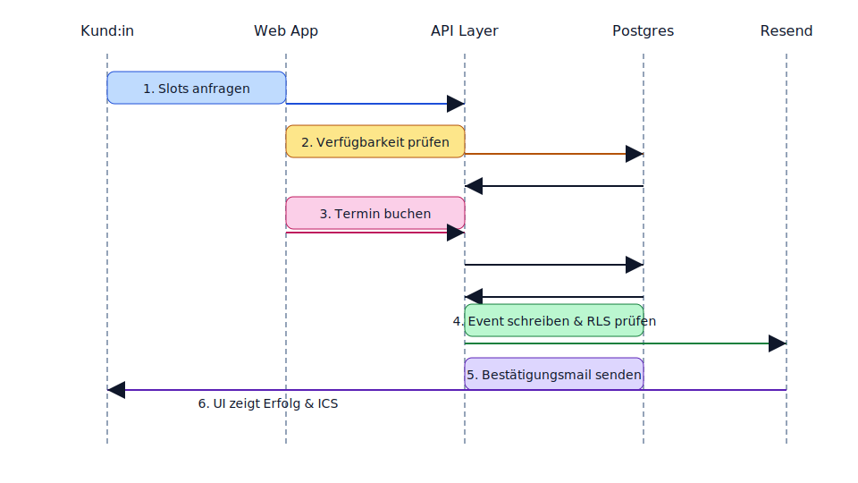
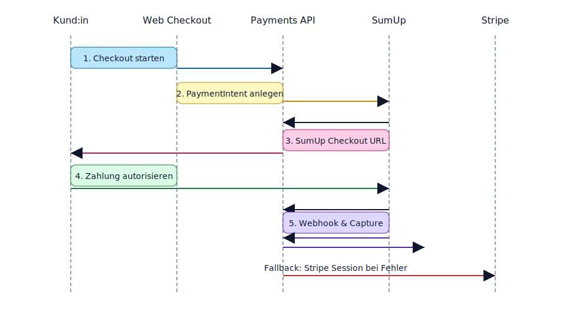
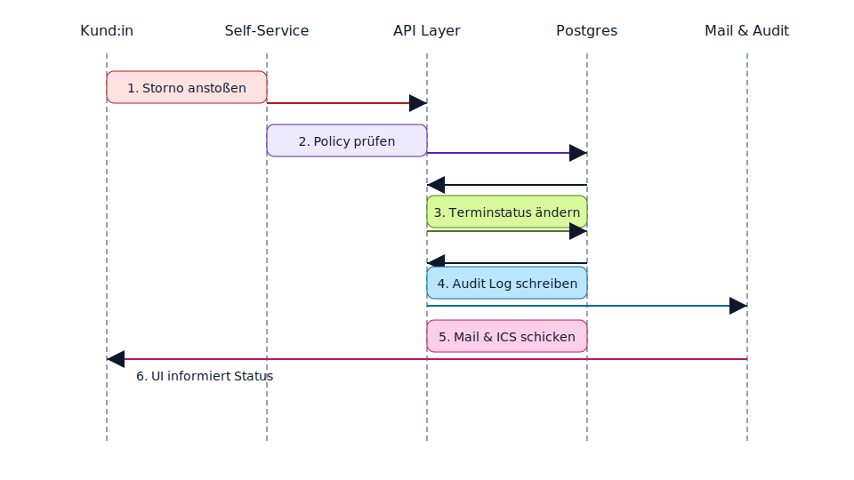
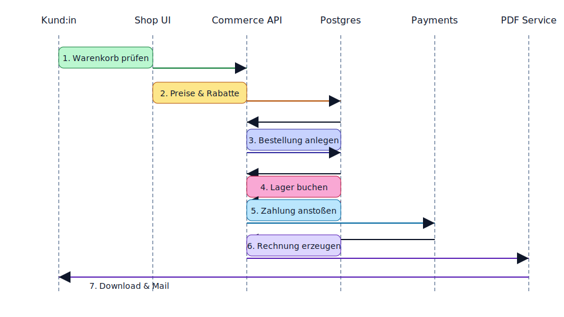

# Architektur – Phase 0 Fundament

## Übersicht
Die Plattform **Schnittwerk by Vanessa Carosella** wird als modularer Monorepo mit Next.js 14, Supabase Postgres und einem Payments-Layer aufgebaut. Der Fokus liegt auf Sicherheit, DSG/DSGVO-Compliance, Performance und Automatisierung.

## Architekturprinzipien
- **Zero-Trust &amp; Least Privilege:** Jede Kommunikation erfolgt über klar definierte Schnittstellen mit RLS-Policies.
- **Beobachtbarkeit:** Strukturierte JSON-Logs, Health-/Ready-Checks und Sentry-Tracing sind Pflicht.
- **Automatisierung:** CI deckt Build, Lint, Tests, Migrationen und Lighthouse ab.
- **Mandantensicherheit:** Rollen und RLS erzwingen Datentrennung zwischen Public, Team und Admins.
- **A11y &amp; Performance First:** Marketing-Routen sind SSR gerendert, Core Web Vitals haben Budget-Grenzen.

## Komponenten
- **apps/web:** Next.js App Router für Marketing, Buchung, Shop und Admin.
- **packages/db:** Drizzle-Schema, Migrationen, Seeds und Policy-Tests.
- **packages/ui:** Geteilte, barrierefreie React-Komponenten.
- **packages/lib:** Domain-Logik (Termin, Inventur, Pricing) plus Observability-Utilities.
- **packages/payments:** Adapter für SumUp, Stripe und Terminal-Abgleich.
- **docs:** Architektur, Security, Privacy, Runbook und Decisions.
- **.github/workflows:** CI/CD mit Multi-Job Pipeline.

## Phase 1 – Datenbank Highlights
- **Domainmodell:** Tabellen für Nutzer:innen, Rollen, Terminwesen, Shop/Inventar sowie Finance (Orders, Payments, Refunds) mit konsistenter UUID-Namensgebung.
- **Schlüssel-Constraints:** `btree_gist` Exclusion Constraint verhindert Terminüberschneidungen (`tstzrange`) pro Mitarbeiter:in. Indizes decken Buchung, Inventur und Checkout Queries ab.
- **RLS & Funktionen:** `app.current_user_id()`, `app.current_roles()` und `app.current_staff_id()` werten JWT-Claims bzw. Session Variablen aus. Policies trennen Public Marketing-Daten von internen Operationen (Owner/Admin/Manager/Reception/Stylist/Customer).
- **Seeds & Tests:** Deterministische Seeds bilden reale Flows (Buchung → Bestellung → Zahlung → Refund) nach. Vitest-Suite prüft Positiv-/Negativfälle gegen Embedded Postgres und dient als Regression-Schutz für RLS.

## Phase 2 – Terminlogik & Kommunikation
- **API-Layer:** Vier Route Handler unter `/api/booking` (`availability`, `create`, `cancel`, `reschedule-request`) kapseln Zod-Validierung, Idempotenz-Schlüssel, RLS-konforme Datenbanktransaktionen und rollenbasierte Autorisierung (`x-schnittwerk-roles`).
- **Scheduling Engine:** Verfügbarkeitsberechnung nutzt Öffnungszeiten, Ausnahmen, Service-Dauern und Buffer-Minuten aus `settings`. Konflikte werden via Exclusion Constraint + `SELECT ... FOR UPDATE` verhindert.
- **Mail & ICS:** Resend verschickt Terminbestätigungen inkl. `text/calendar` Anhang (Europe/Zurich). Marketing-Opt-In erzeugt Double-Opt-In Notifications.
- **Frontend Booking Flow:** SSR-Seite `/booking` lädt Services/Team serverseitig, Client-Komponente `BookingForm` liefert tastaturfreundliche Auswahl (Service → Stylist:in → Slot) und POST gegen die API.
- **Adminkalender:** Route `(admin)/admin/appointments` zeigt eine 7-Tage-Terminübersicht (nur für Admin/Manager/Reception Header-Rollen) mit Slot-Zeiten, Kund:innenkontakt und Statusbadges.

## Phase 3 – Shop & Zahlungen
- **Catalog & Cart:** SSR-Produktlisting unter `/shop` mit serverseitiger Bestandsvalidierung, Cookie-basierter Warenkorbpflege via Server Actions und A11y-getesteten Client-Formularen für Mengen- und Löschvorgänge.
- **Checkout Engine:** Server Action `submitCheckoutAction` führt Idempotenz, Steuerberechnung (8.1 %, 2.6 %, 3.8 %) und Bargeldrundung zusammen, persistiert Order/Payment-Records und delegiert an den Payment-Adapter-Registry.
- **Payment Layer:** `@schnittwerk/payments` liefert produktive Adapter für SumUp (Client-Credentials Flow, Checkout Redirect) und Stripe (Payment Intent Confirm), inklusive Vitest-Mocks und zentralem Registry-Factory.
- **Webhooks & Reconciliation:** API-Routen für SumUp/Stripe validieren Signaturen, aktualisieren Payment/Order Status und enqueuen einen Upstash-Reconciliation-Job; `/api/payments/reconcile` führt Jobs best effort aus und stempelt `reconciled_at` im Payment-Metadatum.
- **Receipts & PDFs:** Checkout beantwortet erfolgreiche Direktzahlungen mit sofortigem Quittungslink, während später Phase 4 die PDF-Generierung (siehe `apps/web/lib/pdf.ts`) integriert.

## Phase 4 – Adminportal & Inventur
- **RBAC & Navigation:** Das `(admin)`-Layout wertet die Header `x-schnittwerk-roles` und `x-schnittwerk-staff-id` aus, blendet nicht freigegebene Bereiche aus und begrenzt Stylist:innen auf eigene Kalenderdaten.
- **Kund:innenverwaltung:** `/admin/customers` konsolidiert Kontakt, Termin- und Umsatzhistorie, Opt-In Status sowie DSG-konforme Export-/Löschfunktionen. CSV-Exports laufen über `/api/admin/customers/export`.
- **Inventur:** `/admin/inventory` bietet manuelle Zähllisten, CSV Import/Export (`parseInventoryCsv` / `buildInventoryCsv`) und protokollierte Bestandsanpassungen in `stock_movements`. Warnungen erscheinen bei fehlenden SKUs und Unterschreitung von Schwellenwerten.
- **Einstellungen:** `/admin/settings` pflegt Buchungsschalter, Öffnungszeiten, Feiertage, Teamstatus und Rollenverteilung. Aktionen aktualisieren `settings`, `opening_hours`, `opening_exceptions`, `staff` sowie `role_assignments` und erzeugen Audit-Einträge.
- **Analytics:** `/admin/analytics` aggregiert Umsatz pro Service, Orders nach Kanal, Terminstatus (90 Tage) und Neukund:innen pro Monat als Reporting-Grundlage. CSV-Exports (`/api/admin/analytics/export`) liefern dieselben Kennzahlen inkl. No-Show-Quote und werden revisionssicher im Audit Log vermerkt.
- **Audit & Exporte:** Der Helper `recordAuditEvent` sammelt alle Admin-Mutationen im `audit_log`; CSV-Downloads für Kund:innen und Inventur gewährleisten revisionsfähige Snapshots.

## Sequenz – Online-Terminbuchung

## Sequenz – Online-Zahlung

## Sequenz – Stornierung &amp; Verschiebung

## Sequenz – Shop Checkout

## Offene Entscheidungen &amp; Risiken
- **SumUp API Limits:** Stripe als Sofort-Fallback vorbereiten.
- **Kalenderüberbuchung:** Exclusion Constraints und Idempotenz-Schlüssel, Lasttests in CI.
- **Datenschutz bei Integrationen:** Consent Wall und DPA-Liste in `/docs/PRIVACY.md` pflegen.
- **Edge Rendering:** CDN &amp; Cache-Konzept in `/docs/RUNBOOK.md` präzisieren.

## Nächste Schritte (Phase 1 Preview)
- Drizzle-Tabellenmodell nach Vorgaben modellieren.
- Seeds für Demo &amp; QA vorbereiten.
- RLS-Policies mit Positiv/Negativtests automatisieren.
